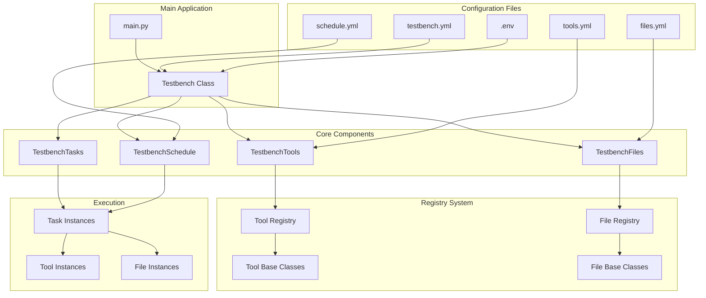
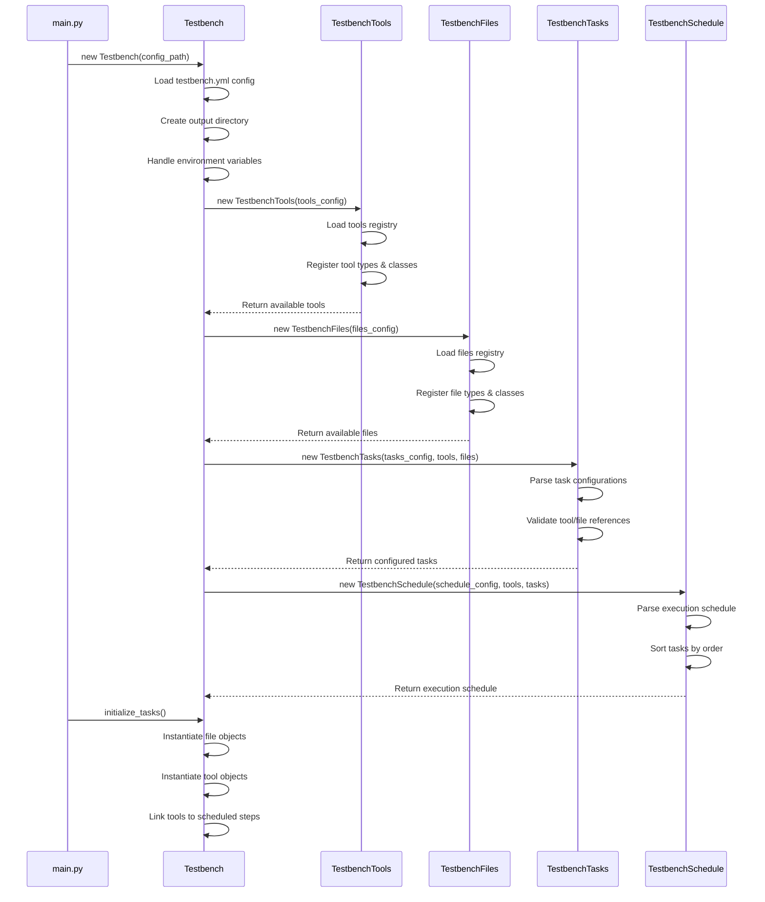
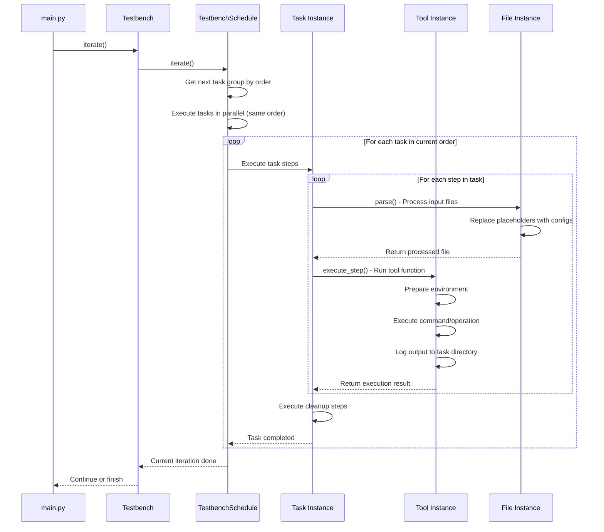
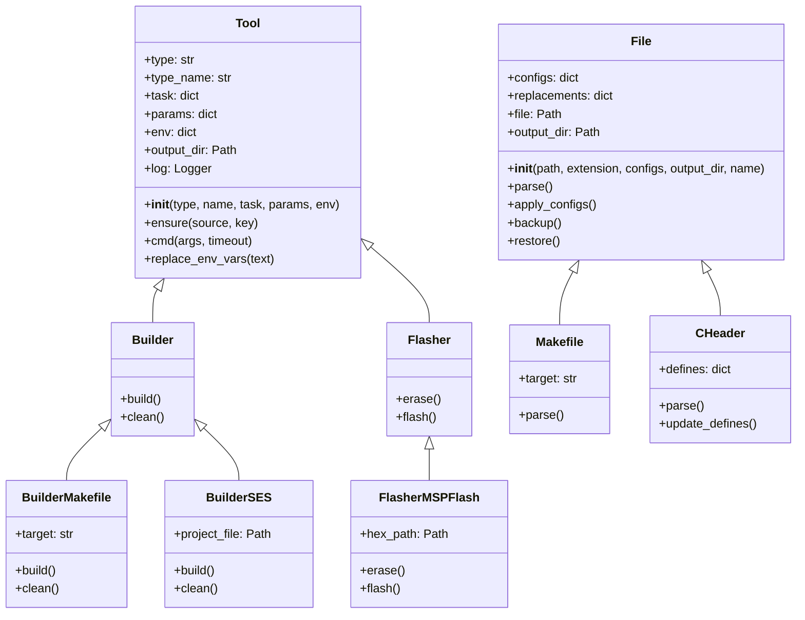

# Testbench Runner

- [Testbench Runner](#testbench-runner)
  - [Structure](#structure)
    - [Overall Architecture](#overall-architecture)
    - [Testbench Initialization Flow](#testbench-initialization-flow)
    - [Task Execution Flow](#task-execution-flow)
    - [Tool and File Architecture](#tool-and-file-architecture)
  - [Setup](#setup)
  - [Configuration](#configuration)
    - [`files.yml`](#filesyml)
    - [`tools.yml`](#toolsyml)
    - [`schedule.yml`](#scheduleyml)
    - [`testbench.yml`](#testbenchyml)
    - [`.env`](#env)
  - [Usage](#usage)
    - [Minimal Example](#minimal-example)
    - [Behaviour](#behaviour)
  - [Registering a New Tool](#registering-a-new-tool)
    - [Creating a New Tool Type](#creating-a-new-tool-type)
    - [Creating a Tool Type Base Class](#creating-a-tool-type-base-class)
    - [Creating a Concrete Tool Implementation](#creating-a-concrete-tool-implementation)
    - [Testing the Tool](#testing-the-tool)
    - [Running the New Tool](#running-the-new-tool)
  - [Registering a New File](#registering-a-new-file)

## Structure

### Overall Architecture



### Testbench Initialization Flow



### Task Execution Flow



### Tool and File Architecture



## Setup

This project requires the [uv](https://astral.sh/uv/) Python package to run. You can install it using pip:

```bash
pip install uv
```

uv will install the required dependencies automatically, so you don't have to worry about them.

You can then build the project using the following command:

```bash
uv build
```

## Configuration

### [`files.yml`](config/files.yml)

This configuration file contains all file types available to the testbench. A file type is a means for the testbench (or its tools) to read, manipulate and use its contents by describing it using a Python class.

The `files.yml` file must contain the `path` field; This is the path to the directory where the file classes are located (default: [`registry/files`](registry/files)).

You can then list all file types directly next to the `path` field, as a key-value pair with the file type as the key and the class name as the value. The file type is used to identify the file in the testbench, and the class name is used to instantiate the file class.

Here is an example of a `files.yml` file:

```yaml
path: registry/files

makefile: Makefile
emproject: EmProject
c_header: CHeader
c_source: CSource
```

### [`tools.yml`](config/tools.yml)

This configuration file contains all tools available to the testbench. A tool is a means for the testbench to run a command on the system, such as a compiler or a flasher by describing it using a Python class.

The `tools.yml` file must contain the `path` field; This is the path to the directory where the tool classes are located (default: [`registry/tools`](registry/tools)).

A tool can be part of a tool type, which means that it can be used in a specific context, such as a compiler or a flasher. You can list all tool types directly next to the `path` field, with the id to be used in other configurations as the key and a list of tools as key-value pairs with the tool type as the key and the class name as the value.

Here is an example of a `tools.yml` file:

```yaml
path: registry/tools

builder:
  makefile: BuilderMakefile
  makefile_msp: BuilderMakefileMSP
  ses: BuilderSES

flasher:
  makefile: FlasherMakefile
  makefile_sd: FlasherMakefileSD
  mspflash: FlasherMSPFlash
  nordic_dfu: FlasherNordicDFU
  openocd_sd: FlasherOpenOCDSD
```

### [`schedule.yml`](config/schedule.yml)

This configuration file contains the schedule for the testbench. A schedule is a list of tasks (described in `testbench.yml`) to be executed in a specific order, with each project having a set of steps to be executed.

Each task has to contain the `order` field, which is a number that determines the order in which the task will be executed. The lower the number, the earlier the task will be executed. Multiple tasks can have the same order, in which case they will be executed concurrently.

Each task then contains the `steps` and `cleanup` fields, which are lists of steps to be executed. The `steps` field contains the steps to be executed before the task is considered complete, while the `cleanup` field contains the steps to be executed after the task is complete, regardless of whether it was successful or not.

A task step is a key-value pair, where the key is the step function (e.g. `build`, `erase`, `flash`, `clean`) and the value is a string of the form `tool_type;tool_id`. The tool type is the type of tool to be used (e.g. `builder`, `flasher`), and the tool id is the id of the tool to be used (e.g. `makefile`, `ses`).

Here is an example of a `schedule.yml` file:

```yaml
build_prog_wulpus_nrf:
  order: 1
  steps:
    build: builder;ses
    erase: flasher;openocd_sd
    flash: flasher;openocd_sd
  cleanup:
    clean: builder;ses

build_prog_wulpus_msp:
  order: 2
  steps:
    build: builder;makefile_msp
    erase: flasher;mspflash
    flash: flasher;mspflash
  cleanup:
    clean: builder;makefile_msp

build_prog_dongle:
  order: 3
  steps:
    build: builder;ses
    flash: flasher;nordic_dfu
  cleanup:
    clean: builder;ses
```

### [`testbench.yml`](config/testbench.yml)

This configuration file contains the top-level testbench configuration. It contains the paths to the other configuration files, as well as the tasks to be executed in the testbench as well as their parameters.

The `testbench.yml` file must contain the `files`, `tools`, and `schedule` fields, which are the paths to the `files.yml`, `tools.yml`, and `schedule.yml` files, respectively.

Then, you can list all tasks to be executed under the `tasks` field.

A task quite a long description. You can have the following fields:

- `path`: Base path of the project which this path may describe, all other paths are relative to this path.
- `tools`: Dictionary of tools to be used in the task, with some optional configurations for each tool.
- `files`: Dictionary of files to be used in the task, with some optional configurations for each file.

The configurations for a tool or file can vary from tool or file. They will be passed to the tool constructor or file class constructor, respectively.

Here is an example of a `testbench.yml` file:

```yaml
schedule: config/schedule.yml

tools: config/tools.yml
files: config/files.yml

tasks:
  build_prog_wulpus_nrf:
    path: <wulpus_path>/fw/nrf52/ble_peripheral/US_probe_nRF52_firmware

    tools:
      flasher:
        name: openocd_sd
        interface: cmsis-dap
        target: nrf52
        sd: <nrf_sdk_path>/components/softdevice/s132
        hex: pca10040/s132/ses/Output/Release/Exe

      builder:
        name: ses

    files:
      emproject:
        path: pca10040/s132/ses
        configs:
          ../../../../../..: <nrf_sdk_path>
      
      c_header:
        path: .
        name: us_defines.h
        configs:
          DEVICE_NAME: TEST_DEVICE_NAME

  build_prog_wulpus_msp:
    path: <wulpus_path>/fw/msp430/wulpus_msp430_firmware

    tools:
      builder:
        name: makefile_msp
        target: wulpus_msp430_firmware.hex
      flasher:
        name: mspflash
        hex: Debug

    files:
      makefile:
        path: Debug
```

### `.env`

As you can see in the example above, some paths are defined as `<wulpus_path>` or `<nrf_sdk_path>`. These are environment variables that you can define in a `.env` file in the root of the project. The testbench will automatically load these variables and replace them in the configuration files.

A tool or file can also reference environment variables in their configurations, which will be replaced by the testbench when the task is executed. The Segger Embedded Studio builder for example needs the path to the SES installation, which can be defined the `SES_PATH` environment variable.

Here is an example of a `.env` file:

```ini
WULPUS_PATH=C:/Users/John/Documents/GitHub/wulpus
NRF_SDK_PATH=C:/Users/John/Documents/GitHub/nRF5_SDK_17.1.0_ddde560
SES_PATH=C:/Program Files (x86)/SEGGER/Embedded Studio for ARM
```

## Usage

### Minimal Example

Here is a minimal example of how to use the testbench:

```python
from wtp import Testbench


PATH = "config/testbench.yml"

tb = None
try:
    tb = Testbench(PATH)
    tb.initialize_tasks()

    tasks = tb.get_tasks()

    print("Running testbench...")
    while not tb.is_done():
        current = tb.iterate()

    print("Done")

except Exception as e:
    print(f"Error running testbench: {e}")
```

### Behaviour

You will see the output of the testbench in the terminal. The testbench also does extensive logging in the background, which can be found in the `output` directory. This directory also contains the output of the tools used in the testbench, such as the build output or the flash output, as well as all files used / modified by the testbench.

## Registering a New Tool

Here, we register a new example tool to the testbench. We want this tool to write "Hello, \<name\>!" to a file called `hello.txt` in the current tasks output directory.

### Creating a New Tool Type

For this, we register a new tool type `hello` in the [`tools`](tools) directory by creating its own directory:

```bash
mkdir registry/tools/hello
```

### Creating a Tool Type Base Class

Then, we create a new tool type base class in the `registry/tools/hello/hello.py` file:

```python
from registry.tools.tool import Tool


class Hello(Tool):
    def __init__(self, name: str, task: dict, params: dict, env: dict):
        super().__init__("hello", name, task, params, env) # Initialize the base class with the tool type "hello"

    def greet(self) -> None:
        raise NotImplementedError # We will implement this method in a subclass
```

As you can see, this class inherits from the `Tool` base class, which provides some basic functionality for the tool. The `greet` method is a placeholder for the actual implementation of the tool in a subclass.

### Creating a Concrete Tool Implementation

We can now create the concrete implementation of the hello tool type, for example a `HelloFile` tool that writes the greeting to a file. We create a new file `registry/tools/hello/hello_file.py`:

```python
from registry.tools.hello.hello import Hello


class HelloFile(Hello):
    def __init__(self, task: dict, params: dict, env: dict):
        super().__init__("file", task, params, env)

        self.greeting_name = self.ensure("params", "user") # We cannot use `name` here, since it is reserved for the tool name

    def greet(self) -> None:
        with open(self.output_dir / "greeting.txt", "w") as f:
            f.write(f"Hello, {self.user}!\n")
```

### Testing the Tool

First, we need to register the new tool and its type in the `tools.yml` file. We add the following entry to the `registry/tools/tools.yml` file:

```yaml
hello:
  file: HelloFile
```

We then use this in the `testbench.yml` file to create a task that uses this tool:

```yaml
tasks:
  greet_user:
    path: . # For the sake of this example, we use the current directory as the project path

    tools:
      hello:
        name: file
        user: Cedric
```

As you can see, we define the tool type `hello` and the tool name `file`, which is the concrete implementation of the `HelloFile` class. We also pass a parameter `user` with the value `Cedric`, which will be used in the tool to greet the user.

We add the task to the `schedule.yml` file:

```yaml
greet_user:
  order: 1
  steps:
    greet: hello;file
```

As you can see, we define the step `greet` with the tool type `hello` and the tool name `file`, which will execute the `greet` method of the `HelloFile` class.

### Running the New Tool

Running the testbench with the added tool will produce the following output in the terminal:

```log
[12:03:06] INFO     Testbench: 'C:\dev\wulpus_testbench\config\testbench.yml'     testbench.py:22
           INFO     Output directory: 'output\20250626-120306'                    testbench.py:34
           INFO     Tools: 'registry\tools'                                           tools.py:25
           INFO     Initialized 3 tool types with 9 tools                             tools.py:33
           INFO     Files: 'C:\dev\wulpus_testbench\config\files.yml'                 files.py:15
           INFO     Files registry: registry\files                                    files.py:27
           INFO     Initialized 1 tasks with 1 tools                                  tasks.py:20
           INFO     Schedule: 'C:\dev\wulpus_testbench\config\schedule.yml'        schedule.py:21
           INFO     Initialized testbench                                         testbench.py:80
           INFO     Initialized 1 tasks with 0 files and 1 tools                 testbench.py:160
           INFO     Running testbench...                                               main.py:17
           INFO     Running task: greet_user                                      schedule.py:176
           INFO     Running step: greet_user/hello/greet                          schedule.py:179
           INFO     Done (0.00s): greet_user/hello/greet                          schedule.py:184
           INFO     Done                                                               main.py:21
```

You can see that the testbench initialized the tools and files, and then executed the `greet_user` task. The output directory is `output/20250626-120306`, which contains the output of the tool.
You can find the greeting in the `output/20250626-120306/greet_user/hello_file/greeting.txt` file:

```text
Hello, Cedric!
```

You can also see that the output directory is created with a timestamp, so you can run the testbench multiple times without overwriting the output.

> [!NOTE]
> All of this seems very complex and it is, but with a growing number of tools and files, it is necessary to keep the testbench organized and maintainable. The testbench is designed to be extensible, so you can easily add new tools and files without having to change the existing code.

## Registering a New File

Here, we register a new example file to the testbench. We want this file to be a simple text file that contains a greeting, to be used in the `greet_user` task we created earlier.

For this, we create a new file type `greeting` in `registry/files/file_greeting.py`:

```python
from pathlib import Path
from typing import Optional

from registry.files.file import File


def line_is_greeting(line: str) -> bool:
    line = line.strip()
    if not line:
        return False
    return line.startswith("Hello, ") and line.endswith("!")


def line_extract_greeting_name(line: str) -> Optional[tuple[str, str, str]]:
    if not line_is_greeting(line):
        return None

    parts = line.strip().split(", ")
    if len(parts) != 2 or not parts[1].endswith("!"):
        return None

    greeting = parts[0]
    user = parts[1][:-1]  # Remove the trailing '!'
    ending = "!"  # The ending is always '!'

    return greeting + ", ", user, ending
    

class Greeting(File):
    def __init__(
        self, path: Path, configs: dict, output_dir: Path, name: Optional[str] = None
    ):
        self.greeting = None

        super().__init__(path, "txt", configs, output_dir, name)

    def parse(self) -> None:
        # Search for USER_NAME in the file
        with open(self.file, "r") as f:
            for i, line in enumerate(f):
                if line_is_greeting(line):
                    if self.greeting is not None:
                        raise ValueError(
                            f"Multiple greetings found in {self.file.name}. Only one is allowed."
                        )

                    line_parsed = line_extract_greeting_name(line)
                    if line_parsed is None:
                        continue

                    before, user, after = line_parsed
                    self.greeting = (before, after)

                    if user in self.configs:
                        if user not in self.replacements:
                            self.replacements[user] = []
                        new = self.configs[user]
                        self.replacements[user].append((i, new))

    def get_greeting(self):
        return self.greeting
```

As you can see, this class inherits from the `File` base class, which provides some basic functionality for the file.

Every file type must implement the `parse` method, which is used to read the file and extract the relevant information. In this case, we search for a line that contains a greeting with a placeholder `USER_NAME`, which we will replace with the actual user using the base class and by returning the greeting in the `get_greeting` method.

We then register the new file type in the `files.yml` file by adding the following entry:

```yaml
greeting: Greeting
```

Now, we modify our previous `HelloFile` class to use this new file type instead of writing the greeting directly to a file:

```python
from registry.tools.hello.hello import Hello


class HelloFile(Hello):
    def __init__(self, task: dict, params: dict, env: dict):
        super().__init__("file", task, params, env)

        self.user = self.ensure("params", "user")
        self.greetings_file = self.ensure("file", "greeting")

    def greet(self) -> None:
        greeting_before, greeting_after = self.greetings_file.get_greeting()
        with open(self.output_dir / "greeting.txt", "w") as f:
            f.write(f"{greeting_before}{self.user}{greeting_after}\n")
```

As you can see, we now use the `greetings_file` attribute to access the `Greeting` file type, which will handle replacing the `USER_NAME` placeholder in the greeting file with the actual user name.

We also modified the `greet` method to write the greeting to the `greeting.txt` file in the output directory, using the `get_greeting` method of the `Greeting` file type.

Now, since we use the file itself to write the greeting, we need to create a template for the greeting file. We create a new file `test/greeting.txt` with the following content:

```text
Hello, USER_NAME!
```

We then modify the `testbench.yml` file to use the new file type in the `greet_user` task at the given location:

```yaml
tasks:
  greet_user:
    path: test # Here, we set the base path to the `test` directory, where the greeting file is located

    tools:
      hello:
        name: file
        user: Cedric # We pass the user name as a parameter to the tool

    files:
      greeting:
        path: . # The path is relative to the base path of the task, which is `test`
        name: greeting.txt
        configs:
          USER_NAME: Cedric # We replace the USER_NAME placeholder with the actual user name
```

This will then produce the same output as before, but now we also have a `files` directory in the task output directory that contains the `greeting.txt` file with the following content:

```text
Hello, Cedric!
```

This means that the `USER_NAME` placeholder in the `greeting.txt` file was replaced with the actual user name `Cedric`.

As well as `greeting.bak`, which is a backup of the original file before the replacement was made.

> [!NOTE]
> In the future, the functionality of directly writing to a file will be moved to the `File` base class, so that all file types can use it. This will make it easier to create new file types that need to write to a file. Also, we should be able to create new files and not relay on existing files, so that we can create files from scratch.
