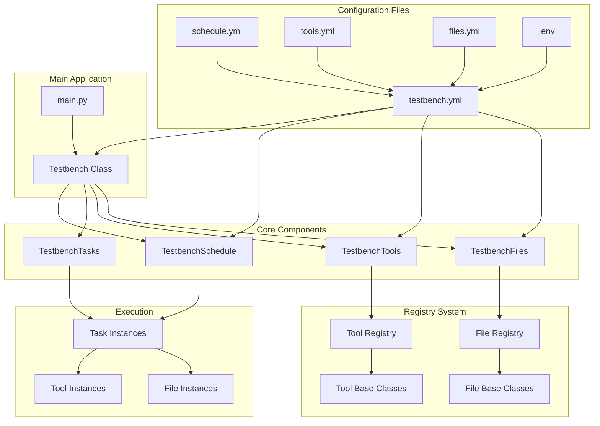
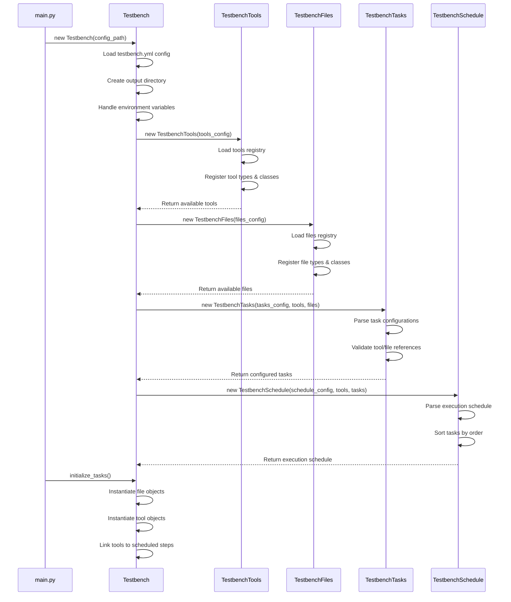
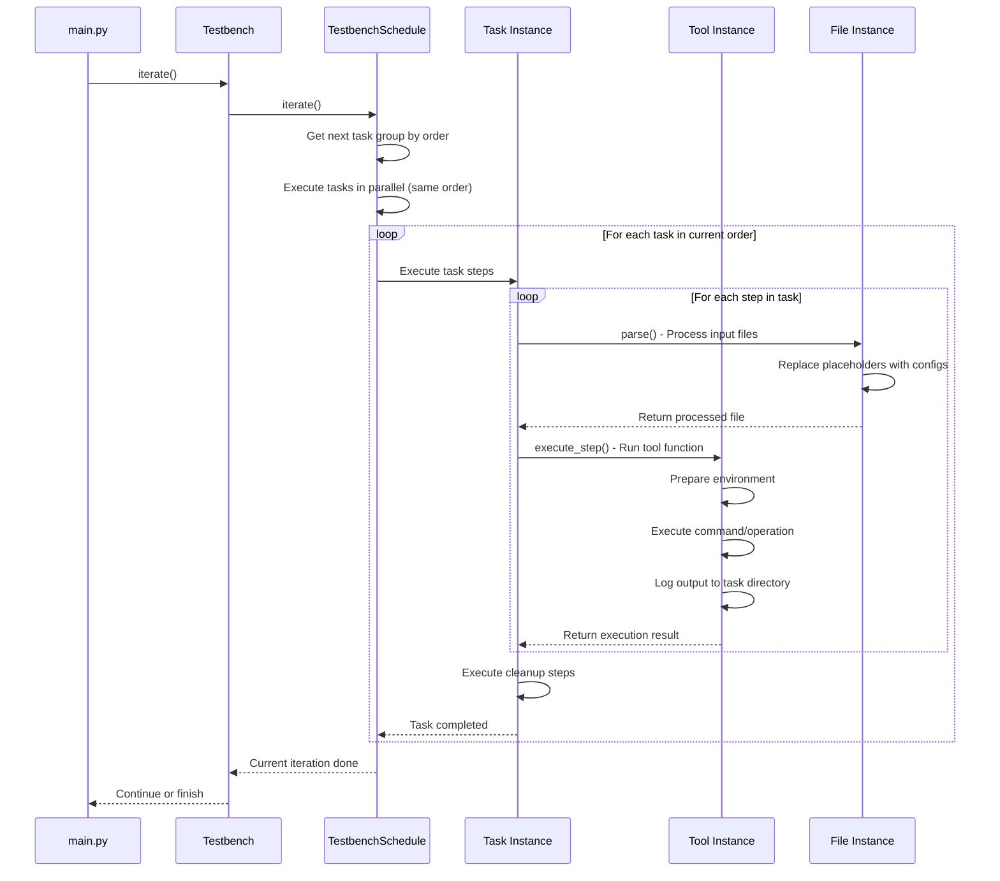
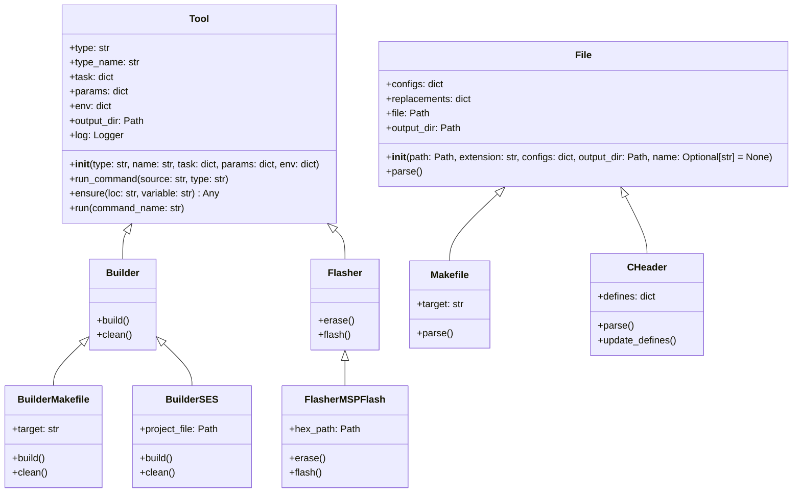

# Testbench Runner

- [Testbench Runner](#testbench-runner)
  - [Usage](#usage)
    - [Setup](#setup)
  - [Getting Started](#getting-started)
  - [Configuration](#configuration)
    - [`testbench.yml`](#testbenchyml)
    - [Task Configuration](#task-configuration)
    - [`files.yml`](#filesyml)
    - [`tools.yml`](#toolsyml)
    - [`schedule.yml`](#scheduleyml)
    - [`.env`](#env)
  - [Registering a New Task/Tool](#registering-a-new-tasktool)
    - [Creating a New Tool Type](#creating-a-new-tool-type)
    - [Creating a Tool Type Base Class](#creating-a-tool-type-base-class)
    - [Creating a Concrete Tool Implementation](#creating-a-concrete-tool-implementation)
    - [Testing the Tool](#testing-the-tool)
    - [Running the New Tool](#running-the-new-tool)
  - [Registering a New File](#registering-a-new-file)
  - [Structure](#structure)
    - [Overall Architecture](#overall-architecture)
    - [Testbench Initialization Flow](#testbench-initialization-flow)
    - [Task Execution Flow](#task-execution-flow)
    - [Tool and File Architecture](#tool-and-file-architecture)


## Usage

### Setup

This project requires the [uv](https://astral.sh/uv/) Python package to run. You can install it using pip:

```bash
pip install uv
```

This library can be included in a Python project as a **submodule**. If you add the submodule to the base directory of your project, you need to add the following line to the `pyproject.toml` file:

```toml
[tool.uv.workspace]
members = ["python_testbench"]

[tool.uv.sources]
python_testbench = { workspace = true }
testbench = { workspace = true }
```

And then add the testbench via the command:

```bash
uv add python_testbench
```


## Getting Started

A minimal example of how to use the testbench:

```python
from testbench import Testbench


PATH = "config/testbench.yml"

tb = None
try:
    tb = Testbench(PATH)
    tb.initialize_tasks()

    tasks = tb.get_tasks()

    print("Running testbench...")
    while not tb.is_done():
        current = tb.iterate()

    print("Done")

except Exception as e:
    print(f"Error running testbench: {e}")
```

To see how to configure the testbench, see the [Configuration](#configuration) section below.


## Configuration

### [`testbench.yml`](config/testbench.yml)

This configuration file contains the top-level testbench configuration. It contains the paths to the other configuration files, as well as the tasks to be executed in the testbench as well as their parameters.

The `testbench.yml` file must contain the `files`, `tools`, and `schedule` fields, which are the paths to the `files.yml`, `tools.yml`, and `schedule.yml` files, respectively.

Then, you can list all tasks to be executed under the `tasks` field.

A task quite a long description. You can have the following fields:

- `path`: Base path of the project which this path may describe, all other paths are relative to this path.
- `tools`: Dictionary of tools to be used in the task, with some optional configurations for each tool.
- `files`: Dictionary of files to be used in the task, with some optional configurations for each file.

The configurations for a tool or file can vary from tool or file. They will be passed to the tool constructor or file class constructor, respectively.

Here is an example of a `testbench.yml` file:

```yaml
schedule: !inc config/schedule.yml

registry:
  tools: !inc config/registry/tools.yml
  files: !inc config/registry/files.yml

tasks:
  program_stm:   !inc config/tasks/program_stm.yml
  test_frontend: !inc config/tasks/build_prog_wulpus_msp.yml
  deploy_keys:   !inc config/tasks/build_prog_dongle.yml
```

> [!NOTE]
> The `!inc` directive is used to include other YAML files in the configuration. This allows you to split the configuration into multiple files for better organization and maintainability.
>
> You can also write the configuration directly in the `testbench.yml` file, but it is recommended to use the `!inc` directive to keep the configuration organized.


### Task Configuration

A task can look like this:

```yaml
path: <project_path>/fw/stm32

tools:
  flasher:
    name: openocd
    interface: cmsis-dap
    target: stm32l4

  builder:
    name: cmake

files:
  cmakelists:
    path: .
  
  c_header:
    path: .
    name: defines.h
    configs:
      DEVICE_NAME: TEST_DEVICE_NAME
```

Here, we define an example task that builds and flashes a firmware project for an STM32 microcontroller.

The `path` field specifies the base path of the project, which is used to resolve relative paths for files and tools.

We use two tools in this task: a flasher and a builder. The `flasher` tool is used to flash the firmware to the microcontroller, while the `builder` tool is used to build the firmware project. Each tool has a `name` field that specifies the tool type to be used, and additional parameters that are passed to the tool when it is executed.

We also define two files to be used in the task: a `CMakeLists.txt` file and a C header file. Each file has a `path` field that specifies the path to the file relative to the base path of the task. Optionally, you can also specify a `name` field to specify the specific name of the file, otherwise a suitable file will be chosen based on the file type.

The `cmakelists` file is used to configure the build system, while the `c_header` file is used to define some constants that will be used in the firmware code. The `configs` field allows you to specify some configurations for the file, which will be passed to the file class when it is instantiated.


### [`files.yml`](config/files.yml)

This configuration file contains all file types available to the testbench. A file type is a means for the testbench (or its tools) to read, manipulate and use its contents by describing it using a Python class.

The `files.yml` file must contain the `path` field; This is the path to the directory where the file classes are located (default: [`registry/files`](registry/files)).

You can then list all file types directly next to the `path` field, as a key-value pair with the file type as the key and the class name as the value. The file type is used to identify the file in the testbench, and the class name is used to instantiate the file class.

Here is an example of a `files.yml` file:

```yaml
path: registry/files

makefile: Makefile
emproject: EmProject
c_header: CHeader
c_source: CSource
```


### [`tools.yml`](config/tools.yml)

This configuration file contains all tools available to the testbench. A tool is a means for the testbench to run a command on the system, such as a compiler or a flasher by describing it using a Python class.

The `tools.yml` file must contain the `path` field; This is the path to the directory where the tool classes are located (default: [`registry/tools`](registry/tools)).

A tool can be part of a tool type, which means that it can be used in a specific context, such as a compiler or a flasher. You can list all tool types directly next to the `path` field, with the id to be used in other configurations as the key and a list of tools as key-value pairs with the tool type as the key and the class name as the value.

Here is an example of a `tools.yml` file:

```yaml
path: registry/tools

builder:
  makefile: BuilderMakefile
  cmake: BuilderCMake

flasher:
  makefile: FlasherMakefile
  openocd: FlasherOpenOCD
```


### [`schedule.yml`](config/schedule.yml)

This configuration file contains the schedule for the testbench. A schedule is a list of tasks (described in `testbench.yml`) to be executed in a specific order, with each project having a set of steps to be executed.

Each task has to contain the `order` field, which is a number that determines the order in which the task will be executed. The lower the number, the earlier the task will be executed. Multiple tasks can have the same order, in which case they will be executed concurrently.

Each task then contains the `steps` and `cleanup` fields, which are lists of steps to be executed. The `steps` field contains the steps to be executed before the task is considered complete, while the `cleanup` field contains the steps to be executed after the task is complete, regardless of whether it was successful or not.

A task step is a key-value pair, where the key is the step function (e.g. `build`, `erase`, `flash`, `clean`) and the value is a string of the form `tool_type;tool_id`. The tool type is the type of tool to be used (e.g. `builder`, `flasher`), and the tool id is the id of the tool to be used (e.g. `makefile`, `ses`).

Here is an example of a `schedule.yml` file:

```yaml
program_stm:
  order: 1
  steps:
    build: builder;cmake
    erase: flasher;openocd
    flash: flasher;openocd
  cleanup:
    clean: builder;cmake

test_frontend:
  order: 2
  steps:
    test_excitation: tester;ad2
    test_reception: tester;ad2

deploy_keys:
  order: 3
  steps:
    deploy: backend;javascript
```


### `.env`

As you can see in the example above, some paths are defined as `<project_path>`. These are environment variables that you can define in a `.env` file in the root of the project. The testbench will automatically load these variables and replace them in the configuration files.

A tool or file can also reference environment variables in their configurations, which will be replaced by the testbench when the task is executed.

Here is an example of a `.env` file:

```ini
PROJECT_PATH=C:/dev/company/cool_device
```


## Registering a New Task/Tool

Here, we register a new example tool to the testbench. We want this tool to write "Hello, \<name\>!" to a file called `greeting.txt` in the current tasks output directory.


### Creating a New Tool Type

For this, we register a new tool type `hello` in the [`tools`](tools) directory by creating its own directory:

```bash
mkdir registry/tools/hello
```


### Creating a Tool Type Base Class

Then, we create a new tool type base class in the `registry/tools/hello/hello.py` file:

```python
from testbench import Tool


class Hello(Tool):
    def __init__(self, name: str, task: dict, params: dict, env: dict):
        super().__init__("hello", name, task, params, env) # Initialize the base class with the tool type "hello"

    def greet(self) -> None:
        raise NotImplementedError # We will implement this method in a subclass
```

As you can see, this class inherits from the `Tool` base class, which provides some basic functionality for the tool. The `greet` method is a placeholder for the actual implementation of the tool in a subclass.

> [!NOTE]
> The `Tool` base class provides some basic functionality for the tool, such as the `ensure` method to ensure that a parameter or file is present and the `run_command` method to run a command.


### Creating a Concrete Tool Implementation

We can now create the concrete implementation of the hello tool type, for example a `HelloFile` tool that writes the greeting to a file. We create a new file `registry/tools/hello/hello_file.py`:

```python
from registry.tools.hello.hello import Hello


class HelloFile(Hello):
    def __init__(self, task: dict, params: dict, env: dict):
        super().__init__("file", task, params, env)

        self.user = self.ensure("params", "user") # We cannot use `name` here, since it is reserved for the tool name

    def greet(self) -> None:
        with open(self.output_dir / "greeting.txt", "w") as f:
            f.write(f"Hello, {self.user}!\n")
```


### Testing the Tool

First, we need to register the new tool and its type in the `config/registry/tools.yml` file. We add the following entry to the `config/registry/tools.yml` file:

```yaml
path: registry/tools

hello:
  file: HelloFile
```

> [!WARNING]
> Here, the naming is important: The key `hello` is the tool type, and the value `file` is the name of the concrete implementation of the `HelloFile` class. The testbench will use this to search for the tool class when it is instantiated. In this case, the testbench will look for the `HelloFile` class in the `registry/tools/hello/hello_file.py` file. If we were to write:
> ```yaml
> path: registry/tools
> 
> hello:
>   console: HelloPrint
> ```
> Then, the testbench would look for the `HelloPrint` class in the `registry/tools/hello/hello_console.py` file.

We then use this in the `config/testbench.yml` and `config/tasks/greet_user.yml` files to create a task that uses this tool:

```yaml
tasks:
  greet_user: !inc config/tasks/greet_user.yml
```

```yaml
path: . # For now, we use the current directory as the project path, since we don't have a specific project path

tools:
  hello:
    name: file
    user: Cedric # We pass the user name as a parameter to the tool
```

As you can see, we use the tool type `hello` with the tool name `file`, which is the concrete implementation of the `HelloFile` class. We also pass a parameter `user` with the value `Cedric`, which will be used in the tool to greet the user.

We add the task to the `schedule.yml` file:

```yaml
greet_user:
  order: 1
  steps:
    greet: hello;file
```

As you can see, we define the step `greet` with the tool type `hello` and the tool name `file`, which will execute the `greet` method of the `HelloFile` class.


### Running the New Tool

Running the testbench with the added tool will produce the following output in the terminal:

```log
[12:00:00] INFO     Testbench:                                               testbench.py:27
                    'C:\dev\github\wulpus_testbench\config\testbench.yml'                   
           INFO     Output directory: 'output\20250101-120000'               testbench.py:37
           INFO     Tools: 'registry\tools'                                      tools.py:16
           INFO     Initialized 3 tool types with 9 tools                        tools.py:24
           INFO     Files registry: registry\files                               files.py:16
           INFO     Initialized 1 tasks with 1 tools                             tasks.py:20
           INFO     Initialized testbench                                    testbench.py:98
           INFO     Initialized 1 tasks with 0 files and 1 tools            testbench.py:189
           INFO     Running testbench...                                          main.py:36
           INFO     Running task: greet_user                                 schedule.py:163
           INFO     Running step: greet_user/hello/greet                     schedule.py:166
           INFO     Done (0.00s): greet_user/hello/greet                     schedule.py:171
           INFO     Done                                                          main.py:40
```

You can see that the testbench initialized the tools and files, and then executed the `greet_user` task. The output directory is `output/20250101-120000`, which contains the output of the tool.
You can find the greeting in the `output/20250101-120000/greet_user/hello_file/greeting.txt` file:

```text
Hello, Cedric!
```

You can also see that the output directory is created with a timestamp, so you can run the testbench multiple times without overwriting the output.

> [!NOTE]
> All of this seems very complex and it is, but with a growing number of tools and files, it is necessary to keep the testbench organized and maintainable. The testbench is designed to be extensible, so you can easily add new tools and files without having to change the existing code.


## Registering a New File

Here, we register a new example file to the testbench. We want this file to be a simple text file that contains a greeting, to be used in the `greet_user` task we created earlier.

For this, we create a new file type `greeting` in `registry/files/file_greeting.py`:

```python
from pathlib import Path
from typing import Optional

from testbench import File


class Greeting(File):
    def __init__(
        self, path: Path, configs: dict, output_dir: Path, name: Optional[str] = None
    ):
        super().__init__(path, "txt", configs, output_dir, name)
```

As you can see, this class inherits from the `File` base class, which provides some basic functionality for the file, including the `parse` method, which is used to read the file and extract the relevant information. In this case, we do not need to implement the `parse` method, since it already is a basic implementation that replaces placeholders in the file with the actual values from the `configs` dictionary.

We then register the new file type in the `config/registry/files.yml` file by adding the following entry:

```yaml
path: registry/files

greeting: Greeting
```

We then add this file to the `greet_user` task in the `config/tasks/greet_user.yml` file:

```yaml
path: test # Now, we use the test directory as the project path

tools:
  hello:
    name: file
    user: Cedric # We pass the user name as a parameter to the tool

files:
  greeting:
    path: .
    name: greeting.txt
    configs:
      USER_NAME: Cedric # We pass the user name as a configuration to the file
```

We create a new file `test/greeting.txt` with the following content:

```text
Hello, USER_NAME!
```

Since we use the `greeting` file type, the testbench will automatically read the `greeting.txt` file and replace the `USER_NAME` placeholder with the actual user name `Cedric`. We thus do not need to add any additional steps to the `schedule.yml` file, since the `greeting` file type will handle the replacement automatically.

This will then produce the same output as before, but now we also have a `files` directory in the task output directory that contains the `greeting.txt` file with the following content:

```text
Hello, Cedric!
```

This means that the `USER_NAME` placeholder in the `greeting.txt` file was replaced with the actual user name `Cedric`.

As well as `greeting.bak`, which is a backup of the original file before the replacement was made.

> [!NOTE]
> In the future, the functionality of directly writing to a file will be moved to the `File` base class, so that all file types can use it. This will make it easier to create new file types that need to write to a file. Also, we should be able to create new files and not relay on existing files, so that we can create files from scratch.

## Structure

### Overall Architecture



### Testbench Initialization Flow



### Task Execution Flow



### Tool and File Architecture

