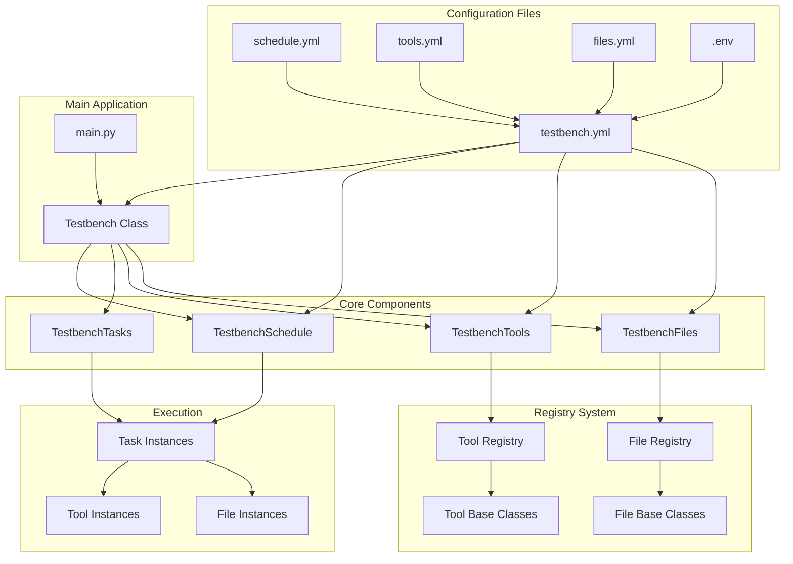
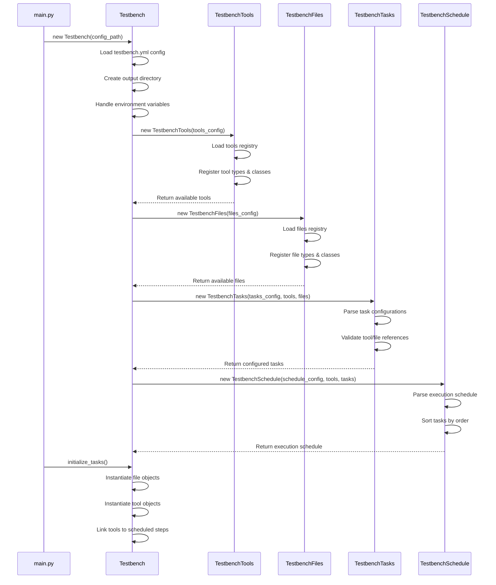
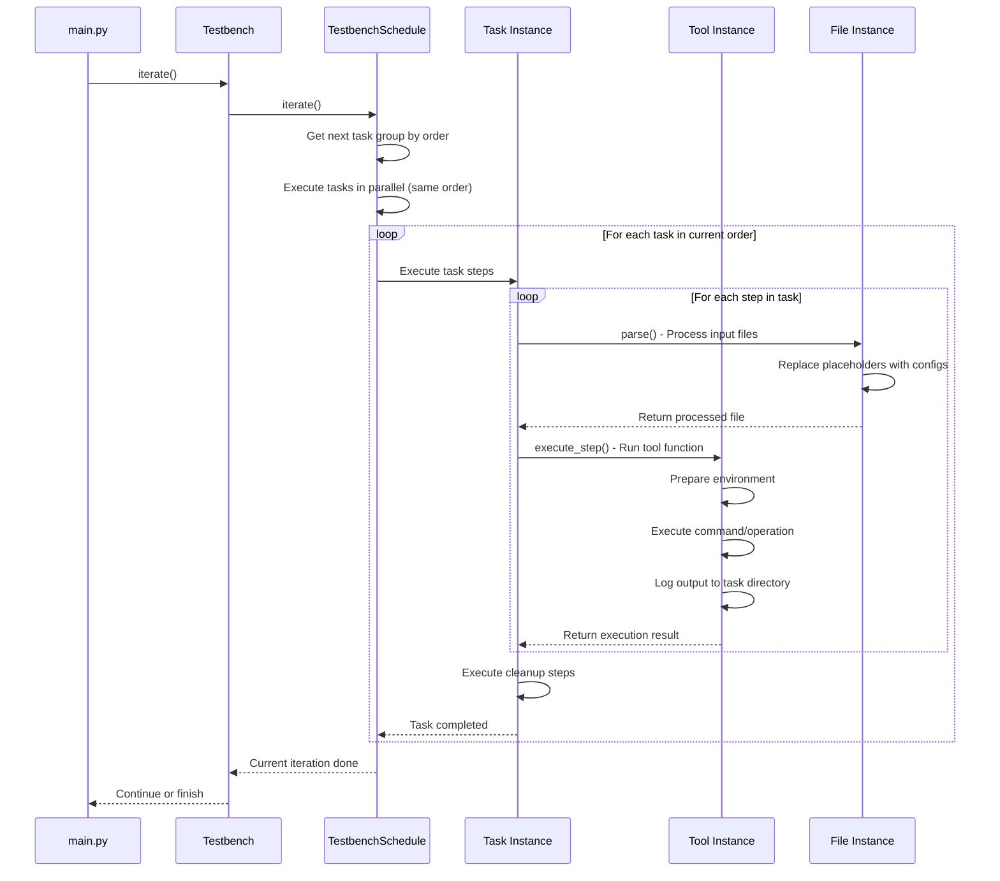
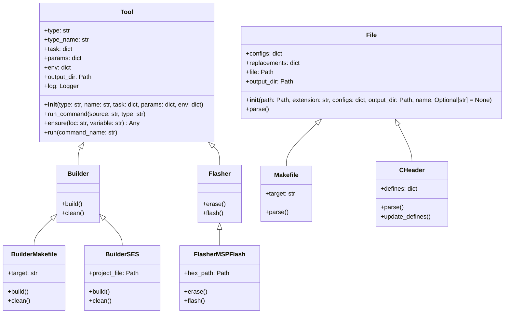

## Overall Architecture

```mermaid
graph TB
    subgraph "Configuration Files"
        TB_CONFIG[testbench.yml]
        SCHEDULE_CONFIG[schedule.yml] --> TB_CONFIG
        TOOLS_CONFIG[tools.yml] --> TB_CONFIG
        FILES_CONFIG[files.yml] --> TB_CONFIG
        ENV_FILE[.env] --> TB_CONFIG
    end
    
    subgraph "Main Application"
        MAIN[main.py]
        TESTBENCH[Testbench Class]
    end
    
    subgraph "Core Components"
        SCHEDULE[TestbenchSchedule]
        TASKS[TestbenchTasks]
        TOOLS[TestbenchTools]
        FILES[TestbenchFiles]
    end
    
    subgraph "Registry System"
        TOOL_REGISTRY[Tool Registry]
        FILE_REGISTRY[File Registry]
        TOOL_BASE[Tool Base Classes]
        FILE_BASE[File Base Classes]
    end
    
    subgraph "Execution"
        TASK_INSTANCES[Task Instances]
        TOOL_INSTANCES[Tool Instances]
        FILE_INSTANCES[File Instances]
    end
    
    MAIN --> TESTBENCH
    TB_CONFIG --> TESTBENCH
    
    TESTBENCH --> SCHEDULE
    TESTBENCH --> TASKS
    TESTBENCH --> TOOLS
    TESTBENCH --> FILES
    
    TB_CONFIG --> SCHEDULE
    TB_CONFIG --> TOOLS
    TB_CONFIG --> FILES
    
    TOOLS --> TOOL_REGISTRY
    FILES --> FILE_REGISTRY
    
    TOOL_REGISTRY --> TOOL_BASE
    FILE_REGISTRY --> FILE_BASE
    
    TASKS --> TASK_INSTANCES
    TASK_INSTANCES --> TOOL_INSTANCES
    TASK_INSTANCES --> FILE_INSTANCES
    
    SCHEDULE --> TASK_INSTANCES
```

## Testbench Initialization Flow

```mermaid
sequenceDiagram
    participant Main as main.py
    participant TB as Testbench
    participant Tools as TestbenchTools
    participant Files as TestbenchFiles
    participant Tasks as TestbenchTasks
    participant Schedule as TestbenchSchedule
    
    Main->>TB: new Testbench(config_path)
    TB->>TB: Load testbench.yml config
    TB->>TB: Create output directory
    TB->>TB: Handle environment variables
    
    TB->>Tools: new TestbenchTools(tools_config)
    Tools->>Tools: Load tools registry
    Tools->>Tools: Register tool types & classes
    Tools-->>TB: Return available tools
    
    TB->>Files: new TestbenchFiles(files_config)
    Files->>Files: Load files registry
    Files->>Files: Register file types & classes
    Files-->>TB: Return available files
    
    TB->>Tasks: new TestbenchTasks(tasks_config, tools, files)
    Tasks->>Tasks: Parse task configurations
    Tasks->>Tasks: Validate tool/file references
    Tasks-->>TB: Return configured tasks
    
    TB->>Schedule: new TestbenchSchedule(schedule_config, tools, tasks)
    Schedule->>Schedule: Parse execution schedule
    Schedule->>Schedule: Sort tasks by order
    Schedule-->>TB: Return execution schedule
    
    Main->>TB: initialize_tasks()
    TB->>TB: Instantiate file objects
    TB->>TB: Instantiate tool objects
    TB->>TB: Link tools to scheduled steps
```

## Task Execution Flow

```mermaid
sequenceDiagram
    participant Main as main.py
    participant TB as Testbench
    participant Schedule as TestbenchSchedule
    participant Task as Task Instance
    participant Tool as Tool Instance
    participant File as File Instance
    
    Main->>TB: iterate()
    TB->>Schedule: iterate()
    
    Schedule->>Schedule: Get next task group by order
    Schedule->>Schedule: Execute tasks in parallel (same order)
    
    loop For each task in current order
        Schedule->>Task: Execute task steps
        
        loop For each step in task
            Task->>File: parse() - Process input files
            File->>File: Replace placeholders with configs
            File-->>Task: Return processed file
            
            Task->>Tool: execute_step() - Run tool function
            Tool->>Tool: Prepare environment
            Tool->>Tool: Execute command/operation
            Tool->>Tool: Log output to task directory
            Tool-->>Task: Return execution result
        end
        
        Task->>Task: Execute cleanup steps
        Task-->>Schedule: Task completed
    end
    
    Schedule-->>TB: Current iteration done
    TB-->>Main: Continue or finish
```

## Tool and File Architecture

```mermaid
classDiagram
    class Tool {
        +type: str
        +type_name: str
        +task: dict
        +params: dict
        +env: dict
        +output_dir: Path
        +log: Logger
        
        +__init__(type: str, name: str, task: dict, params: dict, env: dict)
        +run_command(source: str, type: str)
        +ensure(loc: str, variable: str) Any
        +run(command_name: str)
    }
    
    class Builder {
        +build()
        +clean()
    }
    
    class Flasher {
        +erase()
        +flash()
    }
    
    class BuilderMakefile {
        +target: str
        +build()
        +clean()
    }
    
    class BuilderSES {
        +project_file: Path
        +build()
        +clean()
    }
    
    class FlasherMSPFlash {
        +hex_path: Path
        +erase()
        +flash()
    }
    
    class File {
        +configs: dict
        +replacements: dict
        +file: Path
        +output_dir: Path
        
        +__init__(path: Path, extension: str, configs: dict, output_dir: Path, name: Optional[str] = None)
        +parse()
    }
    
    class Makefile {
        +target: str
        +parse()
    }
    
    class CHeader {
        +defines: dict
        +parse()
        +update_defines()
    }
    
    Tool <|-- Builder
    Tool <|-- Flasher
    Builder <|-- BuilderMakefile
    Builder <|-- BuilderSES
    Flasher <|-- FlasherMSPFlash
    
    File <|-- Makefile
    File <|-- CHeader
```